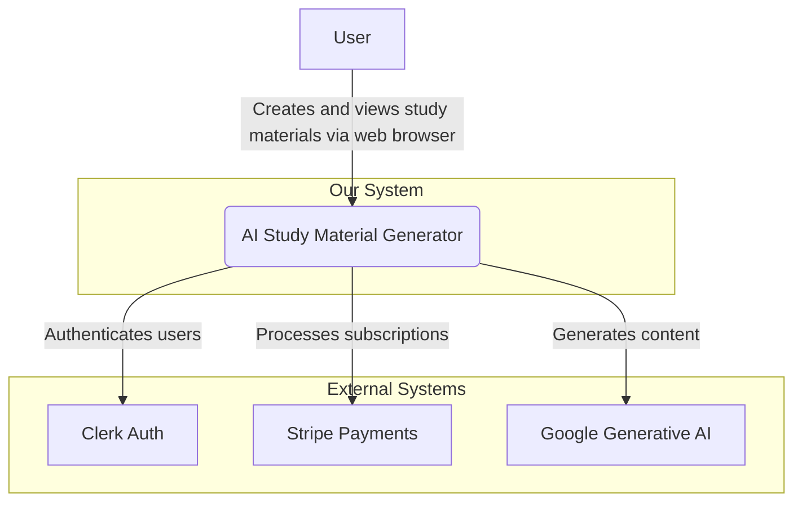
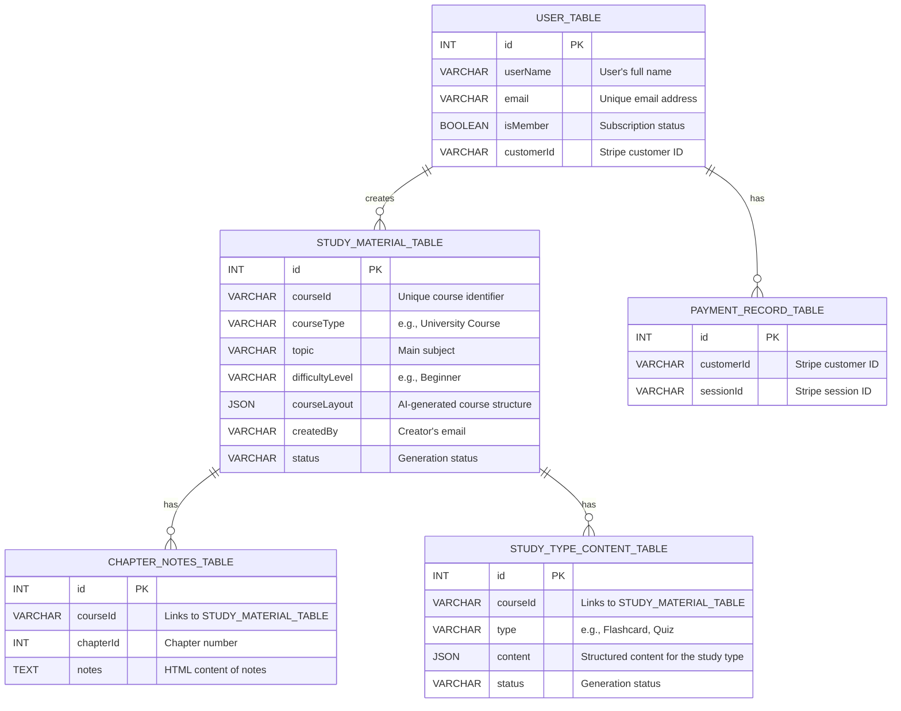

# Comprehensive Project Report: AI Study Material Generator

**Version:** 1.0
**Date:** October 6, 2025

---

## **Table of Contents**

1.  [**Introduction**](#1-introduction)
    1.1. [Project Motivation and Vision](#11-project-motivation-and-vision)
    1.2. [Target Audience](#12-target-audience)
    1.3. [Scope and Limitations](#13-scope-and-limitations)
    1.4. [Structure of the Report](#14-structure-of-the-report)
2.  [**Technology and Market Analysis**](#2-technology-and-market-analysis)
    2.1. [Analysis of the E-Learning Market](#21-analysis-of-the-e-learning-market)
    2.2. [The Role of Generative AI in Education](#22-the-role-of-generative-ai-in-education)
    2.3. [Justification of Technology Choices](#23-justification-of-technology-choices)
3.  [**System Requirements**](#3-system-requirements)
    3.1. [Functional Requirements](#31-functional-requirements)
    3.2. [Non-Functional Requirements](#32-non-functional-requirements)
4.  [**System Architecture and Design**](#4-system-architecture-and-design)
    4.1. [Architectural Principles](#41-architectural-principles)
    4.2. [High-Level Architecture (C4 Model: Level 1 & 2)](#42-high-level-architecture-c4-model-level-1--2)
    4.3. [Data Flow Diagrams](#43-data-flow-diagrams)
    4.4. [Database Schema Design](#44-database-schema-design)
5.  [**Core Functionality Implementation**](#5-core-functionality-implementation)
    5.1. [User Authentication and Onboarding](#51-user-authentication-and-onboarding)
    5.2. [Course Outline Generation](#52-course-outline-generation)
    5.3. [Asynchronous Content Generation](#53-asynchronous-content-generation)
    5.4. [Frontend Implementation and User Experience](#54-frontend-implementation-and-user-experience)
6.  [**Security and Testing**](#6-security-and-testing)
    6.1. [Security Measures](#61-security-measures)
    6.2. [Testing Strategy](#62-testing-strategy)
7.  [**Deployment and Maintenance**](#7-deployment-and-maintenance)
    7.1. [Deployment Pipeline](#71-deployment-pipeline)
    7.2. [Monitoring and Maintenance](#72-monitoring-and-maintenance)
8.  [**Conclusion**](#8-conclusion)
    8.1. [Summary of Achievements](#81-summary-of-achievements)
    8.2. [Future Work and Roadmap](#82-future-work-and-roadmap)
9.  [**Appendices**](#9-appendices)
    9.1. [Appendix A: Database Schema ERD](#91-appendix-a-database-schema-erd)
    9.2. [Appendix B: Component Architecture Flowchart](#92-appendix-b-component-architecture-flowchart)

---

## **1. Introduction**

### **1.1. Project Motivation and Vision**

The landscape of education is undergoing a profound transformation, driven by technological innovation and a growing demand for more personalized learning experiences. The traditional one-size-fits-all model of content delivery is increasingly inadequate in a world that values individual learning paths and just-in-time knowledge acquisition. Learners, whether they are students in formal education, professionals seeking to upskill, or individuals pursuing personal interests, require tools that can adapt to their unique needs, pace, and goals.

The motivation for the **AI Study Material Generator** stems from this fundamental need. The project's vision is to democratize the creation of high-quality, bespoke educational content. We envision a world where any learner can become the architect of their own study materials, transforming passive consumption of information into an active, engaging, and effective learning process. By leveraging the power of advanced generative artificial intelligence, we aim to eliminate the friction and time-consuming labor of manual content creation.

Our core mission is to empower users by providing a platform that is:
*   **Personalized:** Tailoring content to the user's specified topic, desired depth, and difficulty level.
*   **Efficient:** Reducing the time required to create comprehensive study materials from hours or days to mere minutes.
*   **Comprehensive:** Generating a variety of interconnected study aids, including outlines, detailed notes, and assessment tools like quizzes and flashcards.
*   **Accessible:** Offering an intuitive and user-friendly interface that makes sophisticated AI technology available to everyone, regardless of their technical expertise.

### **1.2. Target Audience**

The platform is designed to serve a diverse range of users, each with distinct needs:

*   **Higher Education Students:** University and college students can use the tool to generate study guides for exams, supplement lecture materials, and deepen their understanding of complex subjects.
*   **Professionals and Corporate Learners:** Individuals in the workforce can create materials for professional development, certification exams, and acquiring new skills required for career advancement.
*   **Lifelong Learners:** Adults pursuing personal interests or self-study can generate structured content on any topic, from history and philosophy to programming and data science.
*   **Educators and Tutors:** Teachers and tutors can use the platform to quickly create supplementary materials, practice questions, and customized lesson plans for their students, freeing up time to focus on instruction and mentorship.

### **1.3. Scope and Limitations**

**In Scope:**
*   Secure user registration, authentication, and profile management.
*   A user-friendly interface for creating new study material requests.
*   AI-powered generation of a course outline based on user inputs (topic, type, difficulty).
*   Asynchronous, background generation of detailed chapter notes in HTML format.
*   On-demand generation of supplementary materials: Flashcards, Quizzes, and Q&A sections.
*   A user dashboard to view, access, and manage all generated study materials.
*   A subscription model managed via Stripe to provide premium features.

**Out of Scope (for the current version):**
*   Real-time collaborative editing of generated materials.
*   Direct integration with Learning Management Systems (LMS) like Moodle or Canvas.
*   Generation of non-textual content such as videos, audio summaries, or interactive simulations.
*   User-uploaded content as a source for generation. The AI currently generates content based on its existing knowledge base.

### **1.4. Structure of the Report**

This document provides a comprehensive overview of the AI Study Material Generator project. It begins with an analysis of the market and the technological foundations of the project. It then details the system requirements, followed by an in-depth exploration of the system architecture and design. The report then delves into the implementation of core functionalities, discusses security and testing strategies, and outlines the deployment process. Finally, it concludes with a summary of achievements and a roadmap for future development.

---

## **2. Technology and Market Analysis**

### **2.1. Analysis of the E-Learning Market**

The global e-learning market is a multi-billion dollar industry characterized by rapid growth and intense competition. Major players like Coursera, Udemy, and Khan Academy have successfully scaled by offering vast libraries of pre-recorded courses. However, their primary model is based on mass distribution of standardized content. While effective for broad audiences, this model often falls short in providing true personalization. A significant gap exists for tools that empower learners to create their own learning paths rather than just consuming existing ones. The trend is shifting from passive learning to active, "just-in-time" learning, where individuals seek specific knowledge to solve immediate problems or achieve specific goals. This project targets this niche by providing a tool for creation, not just consumption.

### **2.2. The Role of Generative AI in Education**

The advent of powerful Large Language Models (LLMs) like Google's Gemini and OpenAI's GPT series represents a paradigm shift for the education sector. These models excel at understanding, summarizing, and generating human-like text on a vast range of subjects. Their application in education is transformative:
*   **Content Creation:** Automating the generation of lesson plans, study guides, and assessment questions.
*   **Personalized Tutoring:** Powering AI tutors that can answer student questions and adapt to their learning pace.
*   **Accessibility:** Providing tools that can summarize complex texts or explain concepts in simpler terms.

This project places itself at the forefront of this trend by using Generative AI as the core engine for content creation, moving beyond simple Q&A bots to a full-fledged material generation platform.

### **2.3. Justification of Technology Choices**

The technology stack was carefully selected to align with the project's architectural principles of scalability, modularity, and developer experience.

*   **Framework: Next.js (with App Router)**
    *   **Why:** Next.js is a full-stack React framework that enables a seamless developer experience for building both the frontend and backend. The App Router, with its support for Server Components, allows for a highly efficient architecture where data fetching and rendering can be done on the server, reducing the amount of JavaScript sent to the client and improving performance.
    *   **Alternatives Considered:** A separate frontend (e.g., Create React App) and backend (e.g., Express.js) would increase architectural complexity and deployment overhead.

*   **Database: Neon (Serverless Postgres)**
    *   **Why:** Neon provides a fully managed, serverless PostgreSQL database. Its key advantages are its ability to scale to zero (reducing costs during idle periods) and its separation of storage and compute, allowing for independent scaling and features like instant branching of databases. This is perfect for a startup-style project with unpredictable traffic.
    *   **Alternatives Considered:** Traditional relational databases (e.g., AWS RDS) require manual scaling and have higher fixed costs. NoSQL databases (e.g., MongoDB) were considered but rejected in favor of Postgres's structured data and relational integrity, which is well-suited for this application's schema.

*   **ORM: Drizzle ORM**
    *   **Why:** Drizzle is a lightweight, TypeScript-native ORM that provides full type safety without the heavy code generation or runtime overhead of other ORMs. Its syntax is very close to SQL, making it intuitive for developers familiar with relational databases. Its performance and type-safety were the deciding factors.
    *   **Alternatives Considered:** Prisma is a powerful alternative but comes with a heavier runtime and a more complex engine. TypeORM is also popular but can lack the compile-time type safety that Drizzle guarantees.

*   **Background Jobs: Inngest**
    *   **Why:** AI content generation can be a long and unpredictable process, making it unsuitable for synchronous API requests. Inngest is a platform designed specifically for managing event-driven, long-running background jobs. It provides reliability features out-of-the-box, such as automatic retries, concurrency controls, and detailed observability into job execution. This decouples the core application from the heavy lifting, ensuring the UI remains responsive.
    *   **Alternatives Considered:** Simple cron jobs (e.g., Vercel Cron Jobs) are suitable for scheduled tasks but not for event-driven workflows. Queue-based systems like BullMQ or AWS SQS require significant setup and management overhead.

*   **Authentication: Clerk**
    *   **Why:** Clerk provides a complete, drop-in solution for user authentication and management. It handles everything from sign-up/sign-in forms and social logins to session management and multi-factor authentication. This allows the development team to focus on core application features instead of reinventing the wheel for security, which is a complex and critical component.
    *   **Alternatives Considered:** Building authentication in-house is time-consuming and fraught with security risks. Other providers like Auth0 are excellent but Clerk's deep integration with Next.js provided a superior developer experience for this project.

---

## **3. System Requirements**

### **3.1. Functional Requirements**

| ID    | Requirement                  | Description                                                                                                                            |
|-------|------------------------------|----------------------------------------------------------------------------------------------------------------------------------------|
| FR-01 | User Registration            | Users shall be able to create a new account using an email and password or a social provider (e.g., Google).                             |
| FR-02 | User Login/Logout            | Registered users shall be able to log in to access their dashboard and log out to end their session securely.                           |
| FR-03 | Course Creation Interface    | An authenticated user shall be able to access a form to specify a topic, course type, and difficulty level for a new study material.      |
| FR-04 | Course Outline Generation    | The system shall use a generative AI to create a structured course outline in JSON format based on the user's input.                     |
| FR-05 | Chapter Note Generation      | The system shall asynchronously generate detailed notes in HTML format for each chapter defined in the course outline.                   |
| FR-06 | Quiz Generation              | On user request, the system shall generate a set of multiple-choice quiz questions based on the course content.                          |
| FR-07 | Flashcard Generation         | On user request, the system shall generate a set of flashcards (front/back pairs) for key concepts in the course.                        |
| FR-08 | Q&A Generation               | On user request, the system shall generate a list of potential questions and their detailed answers based on the course content.         |
| FR-09 | User Dashboard               | Users shall have a personal dashboard that lists all their created study materials and their current generation status.                  |
| FR-10 | Subscription Management      | The system shall integrate with Stripe to allow users to subscribe to a premium plan. Membership status must be reflected in the user profile. |

### **3.2. Non-Functional Requirements**

| ID    | Requirement   | Description                                                                                                                            |
|-------|---------------|----------------------------------------------------------------------------------------------------------------------------------------|
| NFR-01| Performance   | API responses for synchronous operations must be under 500ms. Initial page loads should be under 2 seconds.                               |
| NFR-02| Scalability   | The system must be able to handle a 10x increase in concurrent users and course generation requests without significant performance degradation. |
| NFR-03| Reliability   | The application shall have an uptime of 99.9%. Background jobs must be idempotent and include automatic retry mechanisms on failure.      |
| NFR-04| Security      | All user data must be encrypted in transit (TLS) and at rest. The application must be protected against common web vulnerabilities (OWASP Top 10). |
| NFR-05| Usability     | The user interface must be intuitive and accessible, adhering to WCAG 2.1 AA standards.                                                  |
| NFR-06| Maintainability | The codebase must be modular, well-documented, and follow consistent coding standards to facilitate future development and maintenance. |

---

## **4. System Architecture and Design**

### **4.1. Architectural Principles**

*   **Serverless-First:** Every component, from the database to the backend functions and background jobs, is based on a serverless model. This minimizes operational overhead and allows for cost-effective, automatic scaling.
*   **Event-Driven:** The system is designed around events. For example, a "user created" event in Clerk triggers a process to create a user profile. A "course requested" event triggers the complex content generation workflow. This decouples components and makes the system more resilient and extensible.
*   **Separation of Concerns:** The application is logically divided into a frontend (UI), a synchronous backend (API routes for immediate requests), and an asynchronous backend (Inngest for long-running tasks). This separation makes the system easier to reason about, develop, and maintain.

### **4.2. High-Level Architecture (C4 Model: Level 1 & 2)**

**Level 1: System Context Diagram**

This diagram shows the AI Study Material Generator as a single system and its interactions with users and external services.



**Level 2: Container Diagram**

This diagram zooms into the system, showing the key containers (applications/services) that compose it.

```mermaid
graph TD
    user[User]

    subgraph "AI Study Material Generator System"
        frontend[Frontend SPA <br> (Next.js/React)]
        api[Backend API <br> (Next.js API Routes)]
        worker[Background Worker <br> (Inngest)]
        db[Database <br> (Neon Postgres)]
    end

    subgraph "External Services"
        clerk[Clerk Auth]
        stripe[Stripe Payments]
        google_ai[Google Generative AI]
    end

    user -- "Interacts with" --> frontend
    frontend -- "Makes API calls to" --> api
    api -- "Authenticates via" --> clerk
    api -- "Manages payments via" --> stripe
    api -- "Writes/Reads data to/from" --> db
    api -- "Sends jobs to" --> worker
    worker -- "Generates content using" --> google_ai
    worker -- "Writes results to" --> db
```

### **4.3. Data Flow Diagrams**

**Course Generation Data Flow:**

1.  **Initiation:** The authenticated user submits the course creation form on the **Frontend**.
2.  **API Request:** The frontend sends a `POST` request to the `/api/generate-course-outline` **API Route**.
3.  **Outline Generation:** The API route constructs a prompt and calls the **Google Generative AI** to get the course outline.
4.  **Initial DB Write:** The API route saves the new course details and the AI-generated outline to the **Database** (`STUDY_MATERIAL_TABLE`) with a status of "Generating".
5.  **Event Trigger:** The API route sends a `notes.generate` event to **Inngest**.
6.  **Immediate Response:** The API route returns a success response to the frontend, which redirects the user to their dashboard.
7.  **Background Processing:** The **Inngest Worker** picks up the `notes.generate` event.
8.  **Content Generation Loop:** The worker iterates through each chapter in the outline, calling the **Google Generative AI** to generate detailed notes for each one.
9.  **Incremental DB Writes:** After each chapter's notes are generated, the worker saves them to the **Database** (`CHAPTER_NOTES_TABLE`).
10. **Final Status Update:** Once all chapters are complete, the worker updates the course status in the `STUDY_MATERIAL_TABLE` to "Ready".

### **4.4. Database Schema Design**

The database is designed in a normalized fashion to ensure data integrity and minimize redundancy.

*   **`USER_TABLE`:** The central table for user identity. The `customerId` from Stripe is stored here to link a user to their payment information.
*   **`STUDY_MATERIAL_TABLE`:** This table holds the metadata for each generated course. The `courseLayout` is stored as a JSONB field for flexibility, as the structure of the AI's output may evolve.
*   **`CHAPTER_NOTES_TABLE`:** This table stores the large text content of the notes. It is linked to the `STUDY_MATERIAL_TABLE` via the `courseId`, allowing for a one-to-many relationship.
*   **`STUDY_TYPE_CONTENT_TABLE`:** This table is designed to hold various types of generated content (quizzes, flashcards) in a structured JSON format, again linked by `courseId`.
*   **`PAYMENT_RECORD_TABLE`:** This table serves as an audit log for payment transactions, linking a Stripe session to a customer.

---

## **5. Core Functionality Implementation**

### **5.1. User Authentication and Onboarding**

Authentication is handled almost entirely by Clerk. The frontend is wrapped in Clerk's provider, which manages session state. When a new user signs up, Clerk is configured to trigger an event. The `inngest/functions.js` file contains the function that listens for this event:

```javascript
// inngest/functions.js

export const CreateNewUser = inngest.createFunction(
  { id: "create-user" },
  { event: "user.create" }, // This event name is configured in Clerk
  async ({ event, step }) => {
    const { user } = event.data;

    // Use a step to ensure the operation is retried on failure
    const result = await step.run("Create New User in DB", async () => {
      const existingUser = await db.select().from(USER_TABLE).where(eq(USER_TABLE.email, user?.primaryEmailAddress?.emailAddress));
      if (existingUser.length === 0) {
        return await db.insert(USER_TABLE).values({
          userName: user?.fullName,
          email: user?.primaryEmailAddress?.emailAddress,
        }).returning({ id: USER_TABLE.id });
      }
      return existingUser;
    });
    return { status: "Success", userId: result[0]?.id };
  }
);
```

### **5.2. Course Outline Generation**

This is the primary synchronous API endpoint that kicks off the entire workflow.

```javascript
// app/api/generate-course-outline/route.js

export async function POST(req) {
  try {
    const { courseId, topic, courseType, difficultyLevel, createdBy } = await req.json();
    
    // 1. Construct a detailed prompt for the AI
    const PROMPT = `generate a study material for '${topic}'... in JSON format`;

    // 2. Call the AI model
    const aiResp = await courseOutlineAIModel.sendMessage(PROMPT);
    const aiResult = JSON.parse(aiResp.response.text());

    // 3. Save the initial record to the database
    const dbResult = await db.insert(STUDY_MATERIAL_TABLE).values({
        courseId, topic, courseType, difficultyLevel, createdBy,
        courseLayout: aiResult,
        status: 'Generating' // Set initial status
    }).returning({ resp: STUDY_MATERIAL_TABLE });

    // 4. Trigger the background job
    await inngest.send({
      name: "notes.generate",
      data: { course: dbResult[0].resp },
    });

    return NextResponse.json({ result: dbResult[0] });
  } catch (error) {
    // ... error handling
  }
}
```

### **5.3. Asynchronous Content Generation**

The `GenerateNotes` Inngest function handles the heavy lifting in the background.

```javascript
// inngest/functions.js

export const GenerateNotes = inngest.createFunction(
  { id: "generate-course" },
  { event: "notes.generate" },
  async ({ event, step }) => {
    const { course } = event.data;

    // This step runs the entire chapter generation process.
    // If it fails, Inngest will retry from the beginning of this step.
    await step.run("Generate and Save All Chapter Notes", async () => {
      const chapters = course?.courseLayout?.chapters;
      
      // Use Promise.all to run generation in parallel for efficiency
      await Promise.all(
        chapters.map(async (chapter, index) => {
          const PROMPT = `Generate detailed content for the chapter: ${JSON.stringify(chapter)} in HTML format.`;
          const result = await generateNotesAiModel.sendMessage(PROMPT);
          const notesContent = await result.response.text();

          // Save each chapter's notes to the database
          await db.insert(CHAPTER_NOTES_TABLE).values({
            chapterId: index + 1,
            courseId: course?.courseId,
            notes: notesContent,
          });
        })
      );
    });

    // A final step to update the status once everything is complete.
    await step.run("Update Course Status to Ready", async () => {
      await db.update(STUDY_MATERIAL_TABLE)
        .set({ status: "Ready" })
        .where(eq(STUDY_MATERIAL_TABLE.courseId, course?.courseId));
    });

    return { status: "success" };
  }
);
```

### **5.4. Frontend Implementation and User Experience**

The frontend, built with React and Next.js, focuses on providing a clean and responsive user experience.
*   **State Management:** React's `useState` and `useContext` hooks are used for managing local component state and global state (like the current user).
*   **Component-Based Architecture:** The UI is broken down into reusable components (e.g., `CourseCardItem`, `DashboardHeader`, `SideBar`) located in the `components/` and `app/dashboard/_components/` directories.
*   **Dynamic Feedback:** When a course is being generated, the UI displays a "Generating..." status. This is achieved by fetching the course list from the database and rendering the status field. The user can see the progress without needing to manually refresh the page (though auto-refreshing could be added via polling or websockets in a future version).

---

## **6. Security and Testing**

### **6.1. Security Measures**

*   **Authentication and Authorization:** Handled by Clerk, which provides robust protection against common authentication vulnerabilities. API routes are protected using Clerk's middleware to ensure only authenticated users can access them.
*   **Input Validation:** All API routes validate incoming data to prevent malformed requests and protect against injection attacks. Environment variables are used for all secrets and keys, and are not exposed to the client-side.
*   **Database Security:** Drizzle ORM helps prevent SQL injection by parameterizing queries. Access to the Neon database is restricted by IP and requires secure credentials.
*   **Cross-Site Scripting (XSS):** React automatically escapes content rendered in JSX, providing protection against XSS. When rendering user-generated HTML content (from the AI), it would need to be sanitized using a library like `dompurify` if it were ever sourced from user input.

### **6.2. Testing Strategy**

*   **Unit Testing:** Key utility functions and individual React components would be tested using a framework like Jest and React Testing Library to ensure they behave as expected in isolation.
*   **Integration Testing:** The interaction between different parts of the system would be tested. For example, testing the flow from an API route call to an Inngest function trigger and the resulting database write.
*   **End-to-End (E2E) Testing:** A framework like Cypress or Playwright would be used to simulate real user workflows, such as signing up, creating a course, and viewing the generated content. This ensures the entire system works together as intended from the user's perspective.

---

## **7. Deployment and Maintenance**

### **7.1. Deployment Pipeline**

The application is designed for easy deployment on a platform like Vercel.
1.  **Source Control:** The code is hosted on GitHub.
2.  **Continuous Integration/Continuous Deployment (CI/CD):** The Vercel platform is linked to the GitHub repository.
3.  **Deployment Trigger:** A `git push` to the `main` branch automatically triggers a new deployment on Vercel.
4.  **Build Process:** Vercel automatically builds the Next.js application, bundles assets, and deploys the API routes as serverless functions.
5.  **Environment Variables:** All secrets (database URLs, AI API keys, Inngest keys) are configured as environment variables in the Vercel project settings.

### **7.2. Monitoring and Maintenance**

*   **Application Monitoring:** Vercel provides analytics and logging for frontend and API route performance.
*   **Background Job Monitoring:** The Inngest dashboard provides detailed, real-time observability into all background jobs, including successes, failures, logs, and retry attempts.
*   **Database Monitoring:** Neon's dashboard provides insights into database health, query performance, and resource usage.
*   **Maintenance:** Regular maintenance would involve updating dependencies, applying security patches, and monitoring logs for unusual activity or performance bottlenecks.

---

## **8. Conclusion**

### **8.1. Summary of Achievements**

The AI Study Material Generator successfully demonstrates the power of combining modern web development frameworks with generative AI to create a valuable and innovative educational tool. The project achieves its core goal of automating the creation of personalized study materials, addressing a clear need in the market. The choice of a serverless, event-driven architecture has proven to be highly effective, resulting in a system that is scalable, resilient, and cost-effective. The project serves as a strong proof-of-concept and a solid foundation for a commercial product.

### **8.2. Future Work and Roadmap**

**Phase 1: Enhancing Core Features (Next 3-6 months)**
*   **Real-time Updates:** Implement websockets or server-sent events to provide real-time progress updates during content generation.
*   **Content Regeneration:** Allow users to regenerate specific chapters or sections if they are not satisfied with the initial output.
*   **Export Options:** Add functionality to export study materials as PDF or Markdown files.

**Phase 2: Expanding Content and Collaboration (6-12 months)**
*   **New Content Types:** Introduce the generation of mind maps, audio summaries, and more complex, interactive simulations.
*   **Collaborative Spaces:** Allow users to share their generated materials with others and create study groups.
*   **Multi-language Support:** Integrate translation services to support content generation in multiple languages.

**Phase 3: Adaptive Learning (12-18 months)**
*   **Performance Tracking:** Track user performance on quizzes to identify knowledge gaps.
*   **Adaptive Content:** Use performance data to automatically generate supplementary materials that target a user's specific weaknesses, creating a truly adaptive learning path.

---

## **9. Appendices**

### **9.1. Appendix A: Database Schema ERD**



### **9.2. Appendix B: Component Architecture Flowchart**

```mermaid
graph TD
    subgraph User Interaction
        A[User]
    end

    subgraph Frontend (Browser)
        B{Next.js/React UI}
    end

    subgraph Backend (Serverless)
        C{API Routes (Next.js)}
        F[Inngest (Background Jobs)]
        G[Database (Neon/Postgres)]
    end

    subgraph External Services
        D[Clerk (Authentication)]
        E[Google Generative AI]
        H[Stripe (Payments)]
    end

    A --> B;
    B --> C;
    C -- "Manages Auth Sessions" --> D;
    C -- "Generates Outline" --> E;
    C -- "Triggers Background Jobs" --> F;
    C -- "CRUD Operations" --> G;
    F -- "Generates Content" --> E;
    F -- "Saves Content" --> G;
    G -- "Drizzle ORM" --> C;
    G -- "Drizzle ORM" --> F;
    C -- "Manages Payments" --> H;
```


